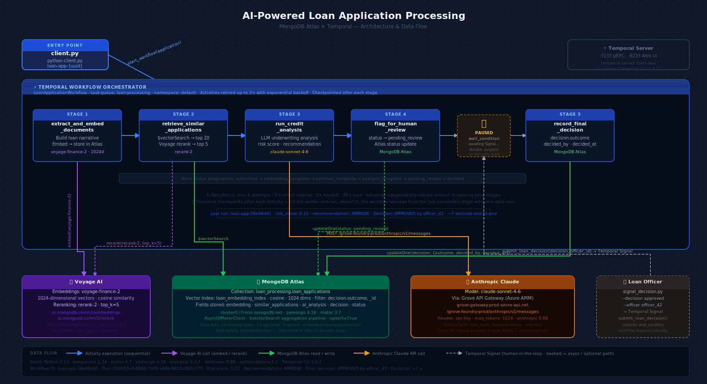

# AI-Powered Loan Application Processing
### MongoDB Atlas × Temporal — Python Quickstart



This quickstart demonstrates how to build a production-grade loan processing
pipeline using **Temporal** for durable workflow orchestration and **MongoDB Atlas**
for intelligent data storage and retrieval.

**What it shows:**

- Temporal: Workflows, Activities, Signals, fault-tolerant execution
- MongoDB: Atlas cluster, document storage, Voyage AI embeddings, Vector Search, Voyage reranking
- Anthropic: Claude-powered credit analysis informed by historical loan decisions

---

## Architecture

```
client.py  →  LoanApplicationWorkflow
                │
                ├── extract_and_embed_documents()   ← Voyage AI embed → Atlas store
                ├── retrieve_similar_applications()  ← Atlas $vectorSearch + Voyage rerank
                ├── run_credit_analysis()            ← Claude underwriting analysis
                ├── flag_for_human_review()          ← Atlas status update
                │
                │   [PAUSED — waiting for signal]
                │
                ├── ← signal_decision.py sends "approved" / "denied"
                │
                └── record_final_decision()          ← Atlas final write
```

Each step is a Temporal Activity — independently retried on failure.
Kill the worker mid-run and restart it: the workflow resumes from the
last completed Activity, not from scratch.

---

## Prerequisites

- Python 3.11+
- [MongoDB Atlas](https://www.mongodb.com/cloud/atlas) account (free tier M0 works)
- [Temporal](https://temporal.io) — local dev server **or** Temporal Cloud
- [Voyage AI](https://www.voyageai.com) API key
- [Anthropic](https://console.anthropic.com) API key

---

## Setup

### 1. Clone and install

```bash
git clone <repo-url>
cd mongo-temporal-loan-quickstart
pip install -r requirements.txt
```

### 2. Configure environment

```bash
cp env.example .env
```

Edit `.env` and fill in your credentials:

```
MONGODB_URI=mongodb+srv://<user>:<password>@<cluster>.mongodb.net/...
MONGODB_DATABASE=loan_processing

VOYAGE_API_KEY=...
ANTHROPIC_API_KEY=...

TEMPORAL_ADDRESS=localhost:7233   # or your Temporal Cloud address
TEMPORAL_NAMESPACE=default
TEMPORAL_TASK_QUEUE=loan-processing
```

### 3. Start Temporal (local)

If you don't have a Temporal Cloud account, run the dev server locally:

```bash
# Install the Temporal CLI: https://docs.temporal.io/cli
temporal server start-dev
```

The Temporal Web UI is then available at **http://localhost:8233**.

### 4. Create the Atlas Vector Search index

```bash
python setup/create_vector_index.py
```

This creates a `vectorSearch` index on the `embedding` field of the
`loan_applications` collection. Wait until the script prints `READY ✓`
before proceeding.

### 5. Seed historical loan data

```bash
python seed/seed_historical_loans.py
```

Inserts 15 historical loan decisions into Atlas, each embedded with
`voyage-finance-2`. These are what Vector Search retrieves as context
for new applications.

---

## Running the Demo

### Terminal 1 — Start the worker

```bash
python worker.py
```

The worker polls Temporal for tasks and executes Activities.

### Terminal 2 — Submit a loan application

```bash
python client.py
```

Sample output:

```
[Temporal] Starting workflow: loan-app-a3f9c1b2
  Applicant : Jane Smith
  Loan      : $25,000 over 60 months
  Purpose   : home renovation
  Income    : $95,000 | Credit score: 720

[Temporal] Workflow started ✓
  Workflow ID : loan-app-a3f9c1b2
  Run ID      : 01234...

Watch progress in the Temporal Web UI:
  http://localhost:8233/namespaces/default/workflows/loan-app-a3f9c1b2

Once the workflow reaches 'pending_review', approve or deny with:
  python signal_decision.py --workflow-id loan-app-a3f9c1b2 --decision approved
```

Watch the worker logs as activities execute:

```
[Activity] extract_and_embed_documents: Embedded 2 documents via voyage-finance-2
[Activity] retrieve_similar_applications: Found 5 similar loans via Atlas Vector Search
[Activity] retrieve_similar_applications: Reranked results via rerank-2
[Activity] run_credit_analysis: Risk score 0.28 — recommendation: APPROVE
[Activity] flag_for_human_review: Status set to pending_review in MongoDB Atlas
[Temporal] Workflow paused: awaiting loan officer signal...
```

### Terminal 2 — Send the loan officer decision

```bash
python signal_decision.py --workflow-id loan-app-a3f9c1b2 --decision approved --officer officer_42
```

Back in the worker logs:

```
[Temporal] Signal received: approved by officer_42
[Activity] record_final_decision: Decision written to MongoDB Atlas
[Temporal] Workflow complete ✓
```

### Verify in MongoDB Atlas

Open Atlas → Browse Collections → `loan_processing.loan_applications`.
Find the document with `_id: "loan-app-a3f9c1b2"` — it will have:

```json
{
  "status": "decided",
  "ai_analysis": { "risk_score": 0.28, "recommendation": "approve", "rationale": "..." },
  "decision": { "outcome": "approved", "decided_by": "officer_42", "decided_at": "..." },
  "similar_applications": ["hist-loan-001", "hist-loan-007", ...]
}
```

---

## Demonstrating Fault Tolerance

One of Temporal's core value propositions: **no progress is lost if the worker crashes**.

1. Start the worker and submit an application (`python client.py`)
2. Wait until the worker logs show Stage 2 complete (`retrieve_similar_applications`)
3. Kill the worker: `Ctrl+C`
4. Restart the worker: `python worker.py`
5. Watch it resume from Stage 3 (`run_credit_analysis`) — Stages 1 and 2 do **not** re-run

This works because Temporal durably checkpoints the workflow state after each
Activity completes. The worker re-reads the event history on restart and replays
only from the last completed checkpoint.

---

## CLI Options

### client.py

```
--workflow-id   Custom workflow ID (default: loan-app-<random>)
--applicant     Borrower name (default: Jane Smith)
--income        Annual income in dollars (default: 95000)
--credit-score  FICO credit score (default: 720)
--employment    Employment status (default: employed)
--amount        Loan amount in dollars (default: 25000)
--purpose       Loan purpose (default: home renovation)
--term-months   Repayment term in months (default: 60)
```

### signal_decision.py

```
--workflow-id   Required. The ID printed by client.py
--decision      Required. "approved" or "denied"
--officer       Officer identifier (default: officer_01)
```

---

## Project Structure

```
mongo-temporal-loan-quickstart/
├── README.md
├── requirements.txt
├── env.example                        # Copy to .env and fill in values
│
├── setup/
│   └── create_vector_index.py         # One-time Atlas Vector Search index creation
│
├── seed/
│   └── seed_historical_loans.py       # Populates Atlas with 15 sample decisions
│
├── workflows/
│   └── loan_workflow.py               # Temporal Workflow: orchestrates all stages
│
├── activities/
│   ├── db.py                          # Shared MongoDB (Motor) connection helper
│   ├── extract_documents.py           # Embed loan docs via Voyage AI → store in Atlas
│   ├── retrieve_similar.py            # Atlas Vector Search + Voyage reranking
│   ├── credit_analysis.py             # Claude underwriting analysis
│   └── record_decision.py             # flag_for_human_review + record_final_decision
│
├── worker.py                          # Temporal Worker entrypoint
├── client.py                          # Submit a loan application (workflow starter)
└── signal_decision.py                 # Simulate loan officer approval/denial
```

---

## Why MongoDB + Temporal Together?

| Alone | What's missing |
|---|---|
| Temporal alone | No durable business data storage — the loan record and embeddings would live only in memory |
| MongoDB alone | No orchestration — a crashed Python script leaves the application in an unknown state |
| **Together** | Temporal owns *where you are* in the process; MongoDB owns *everything you know* about the applicant |

A loan application processed by this system can never be lost, double-processed,
or left in limbo — even if the worker crashes, the database restarts, or an LLM
call times out.
